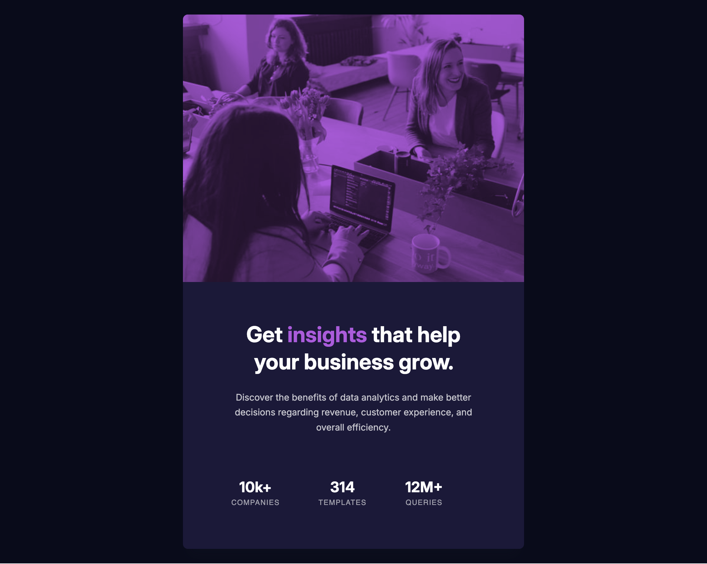

# Frontend Mentor - Stats preview card component solution

This is a solution to the [Stats preview card component challenge on Frontend Mentor](https://www.frontendmentor.io/challenges/stats-preview-card-component-8JqbgoU62). Frontend Mentor challenges help you improve your coding skills by building realistic projects.

## Table of contents

- [Overview](#overview)
  - [The challenge](#the-challenge)
  - [Screenshot](#screenshot)
  - [Links](#links)
- [My process](#my-process)
  - [Built with](#built-with)
  - [What I learned](#what-i-learned)
  - [Continued development](#continued-development)
  - [AI Collaboration](#ai-collaboration)
- [Author](#author)

**Note: Delete this note and update the table of contents based on what sections you keep.**

## Overview

### The challenge

Users should be able to:

- View the optimal layout depending on their device's screen size

### Screenshot





### Links

- Solution URL: [Add solution URL here](https://your-solution-url.com)
- Live Site URL: [Add live site URL here](https://your-live-site-url.com)

## My process

### Built with

- Semantic HTML5 markup
- CSS custom properties
- Flexbox
- Mobile-first workflow

### What I learned

I had trouble with the purple color on top of the image. I though about using a pseudo-element. At first this didn't work because images are replaced elements, so I wrapped the image inside a div and set ::after on that. The color that I got was a lot lighter than the design. That's when I learned about `mix-blend-mode` which controls how an element visually blends with whatever is behind it. So, I set the background color of picture element to purple and used `mix-blend-mode: multiply` on the image.

```css
.card__img-container {
  background-color: var(--color-accent);
  border-radius: 8px 8px 0px 0px;
  overflow: hidden;
}

.card__img {
  width: 100%;
  height: auto;
  display: block;
  mix-blend-mode: multiply;
  border-radius: 8px 8px 0px 0px;
  opacity: 0.8;
}
```

### Continued development

For the moment, I just want to keep going with the newbie projects, I feel like I'm learning something new with each project.

### AI Collaboration

I don't use AI to generate code. I only use it to clarify centrain concepts. I do my best to not use it for debugging. I try to spend some time researching and reading online resources before coming to Claude with my problem and a proposition of how to solve it.

## Author

- Frontend Mentor - [@Kristina2025](https://www.frontendmentor.io/profile/Kristina2025)
